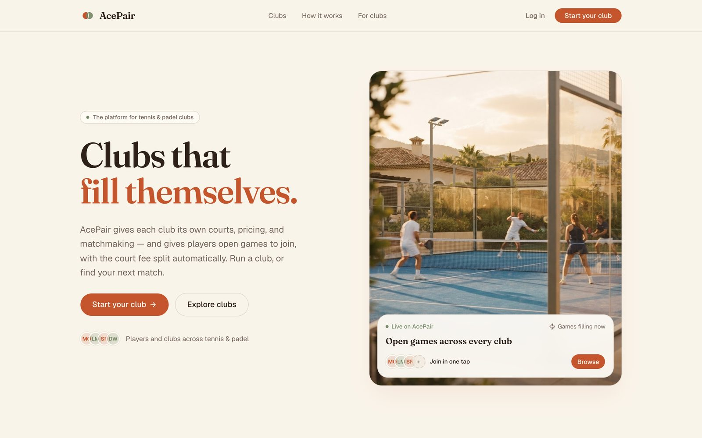
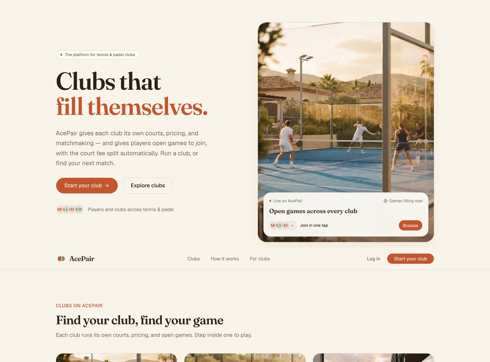
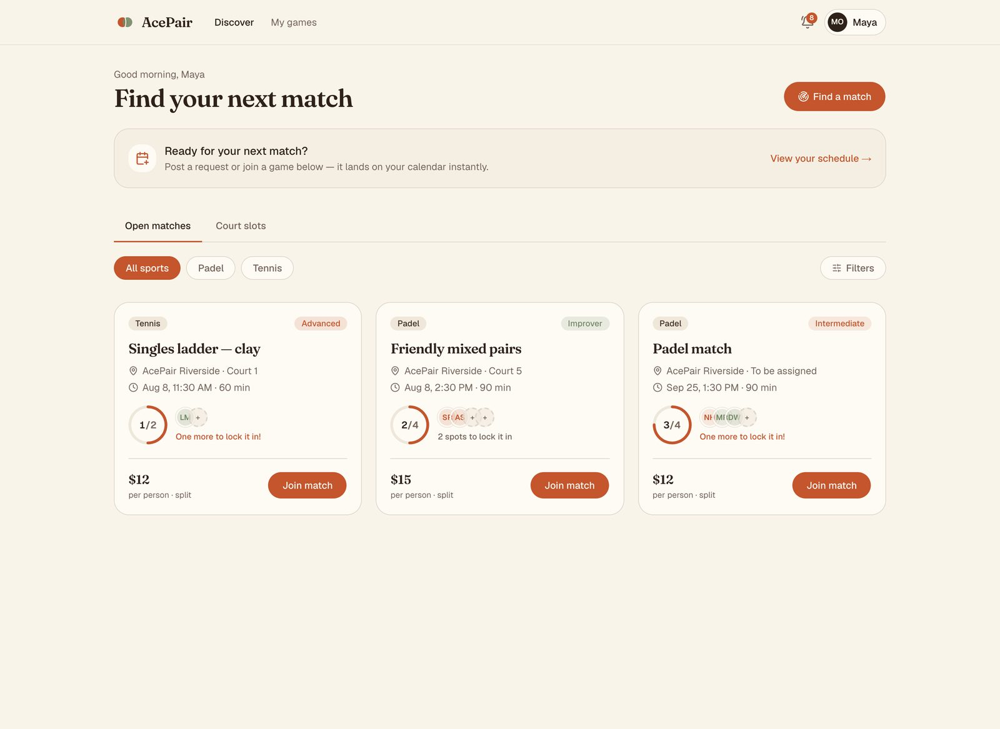
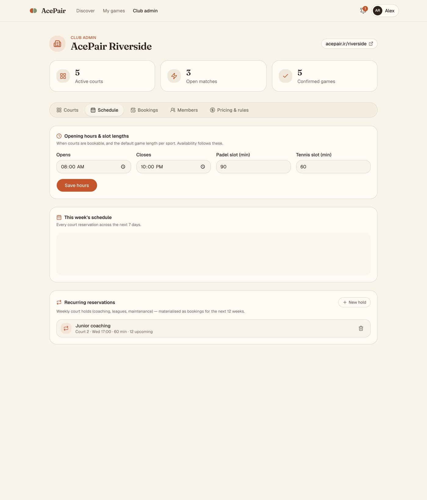
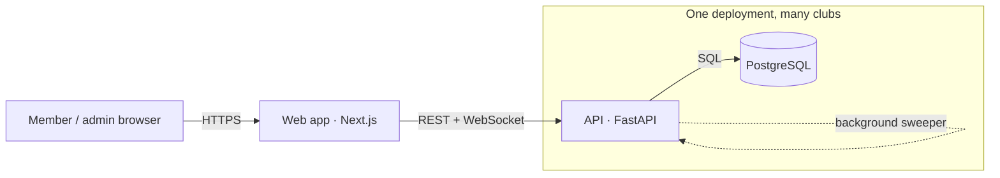

# AcePair 🎾

**AcePair is a general-purpose matchmaking & booking platform for tennis and
padel clubs.** It isn't tied to a single venue: any club can onboard, configure
its own courts and rules, and operate independently inside one shared system.

Members find open games, get matched into full groups by skill and time, book
courts without ever double-booking, and split the court fee automatically. Club
admins define their courts, hours, pricing, and matchmaking rules — all driven by
configuration, never code.

One deployed app serves *every* club (multi-tenant). Each club is walled off from
the others — a member of "Riverside" can never see "Hillcrest" data — and gets its
own page at `acepair.ir/<club>` (and, optionally, its own subdomain).



---

## Table of contents

- [What it does](#what-it-does)
- [Screenshots](#screenshots)
- [Requirements coverage](#requirements-coverage)
- [How it's built](#how-its-built)
- [Run it locally](#run-it-locally)
- [Points to confirm (answered)](#points-to-confirm-answered)
- [Assumptions and limitations](#assumptions-and-limitations)

---

## What it does

| For members | For club admins |
|---|---|
| Discover open matches and available court slots | Register a club in one step |
| Post a "looking for players" request and get auto-matched | Add / retire courts (tennis & padel), set a per-court rate |
| Join a game in one tap; the fee splits across players | Set opening hours and per-sport slot lengths |
| Book a specific court + time, safely | Set pricing (base rate, peak multiplier) and the peak windows |
| Get live notifications when a match fills | Create recurring court holds (coaching, leagues, maintenance) |
| See everything upcoming in "My games" | See the week's schedule and manage every booking |
| Each club has its own page / subdomain | Browse the member directory |
| | Choose match-confirm count, cancellation window & no-show policy |

Everything on the admin side is **data-driven** — a club changes its own behaviour
through configuration, with no code changes per club.

The product is designed to *feel alive*: bookings confirm instantly, matches fill
in real time, and notifications arrive over a live connection rather than a page
refresh.

---

## Screenshots

**The apex is a multi-club directory — each club opens its own page/subdomain**



**Members find and join open games — auto-matched by skill & time, fee split**



**Admins manage courts, opening hours, the week's schedule, and recurring holds**



---

## Requirements coverage

How AcePair delivers each capability from the brief:

| Requirement | How it's delivered |
|---|---|
| **Multi-tenancy** — any club operates its own independent space | One deployment; every row is scoped by `club_id`, and a member's login token carries their club, so cross-club access is *structurally* impossible (there's a test that actively tries to break in). Each club gets its own page `acepair.ir/<club>` and an optional subdomain. |
| **Court setup** — sport, quantity, availability | Admins add/retire any number of tennis & padel courts (surface, indoor/outdoor, optional per-court rate) and set opening hours + slot lengths that drive availability. |
| **Slot booking** | Members book a specific court and time; the database itself refuses two overlapping bookings on a court (a Postgres exclusion constraint), so double-booking cannot happen. |
| **"Looking for players" requests** | Members post an open request (sport, skill, time window, duration) to be matched with others. |
| **Automatic matchmaking** | Compatible requests are grouped the instant they're posted (plus a background sweeper as a safety net); at the club's minimum player count the game **auto-confirms** — creating the booking, the fee split, and notifications. |
| **Fee splitting** | The court fee is split evenly among the confirmed players, recorded in an integer-cents ledger that reconciles to the penny; under-filled groups follow the club's chosen policy. |
| **Per-club configuration** | Sports, courts, hours, slot lengths, fees, peak windows, players-to-confirm, skill tolerance, cancellation window, and unfilled-match policy are all per-club config — not hardcoded to any one setup. |

---

## How it's built



Three pieces, all shipped together with Docker Compose:

1. **Web app** (`/frontend`) — a Next.js site. The visual layer members and admins
   use. Talks to the API over HTTPS.
2. **API** (`/backend`) — a FastAPI service. All the rules live here: booking,
   matchmaking, fees, notifications, tenant isolation.
3. **Database** — PostgreSQL. The single source of truth.

### Five decisions worth knowing about

- **No double-booking, guaranteed by the database.** Instead of hoping two
  requests don't collide, the database itself refuses to store two overlapping
  bookings for the same court (a Postgres *exclusion constraint*). If two people
  tap "book" at the same instant, exactly one wins and the other gets a clean
  "that slot was just taken" — never a silent double-booking.

- **Matchmaking is instant, with a safety net.** When you post a request or join a
  game, AcePair tries to group and confirm you *right away*. A lightweight
  background job also sweeps every few seconds to pair up people who couldn't be
  matched at the moment and to tidy up games that never filled.

- **Money is auditable, never fuzzy.** Every fee is stored in whole cents, and each
  booking produces a **ledger** — one line per player showing exactly what they
  owe. The lines always add up to the total, to the penny. (Payments aren't
  processed yet; the structure is ready for a processor like Stripe to slot in.)

- **One login = one club.** A member's access token carries their club's identity.
  Every database query is filtered by it, so cross-club data leaks are structurally
  impossible, not just discouraged.

- **Kept deliberately simple to deploy.** Postgres + the app, nothing else. Live
  notifications use an in-process channel rather than adding Redis; the code is
  organized so Redis can be dropped in later for larger scale. Fewer moving parts =
  a more reliable deployment.

---

## Run it locally

You need Docker. Copy the example environment file and set a couple of secrets
(nothing is hardcoded):

```bash
cp .env.example .env    # then set POSTGRES_PASSWORD, JWT_SECRET, SEED_DEMO_PASSWORD
docker compose up --build
```

The key settings in `.env` (all documented in `.env.example`):

| Variable | What it's for |
|---|---|
| `POSTGRES_PASSWORD` | Database password (required) |
| `JWT_SECRET` | Long random string that signs login tokens (required) |
| `SEED_DEMO_PASSWORD` | Password for the seeded demo accounts |
| `API_PUBLIC_URL` | The API's public URL, baked into the web build so the browser knows where to call (leave empty to run the web app on built-in demo data) |
| `CORS_ORIGINS` | The web app's public origin(s) |
| `ROOT_DOMAIN` | Domain clubs live under (e.g. `acepair.ir`) — enables club subdomains and their CORS |

> The committed `docker-compose.yml` omits host ports (the hosted setup routes by
> domain). For local access, temporarily add `ports: ["8000:8000"]` and
> `["3000:3000"]` to the `api` / `web` services.

Then (with ports mapped) open:

- **Web app** → http://localhost:3000
- **API docs** (interactive) → http://localhost:8000/docs
- **API health** → http://localhost:8000/health

The API seeds a **demo club** (and a few more clubs for the showcase) on first
boot, so nothing is ever empty:

| Field | Value |
|---|---|
| Club address | `riverside` |
| Email | `alex@riverside.club` (admin) |
| Password | your `SEED_DEMO_PASSWORD` |

---

## Points to confirm (answered)

The brief left five things open. Here's how AcePair resolves each — all
per-club configurable.

**1. Matchmaking criteria — how players are matched.**
A member posts a "looking for players" request with sport, their skill level,
a time preference (a day + morning/afternoon/evening window), and duration.
AcePair groups compatible open requests when they share: the same sport, an
overlapping time window (so a common start time exists), skill within the
club's tolerance (default ±1 band on Beginner → Improver → Intermediate →
Advanced), the same duration, and compatible court preference. When a group
reaches the club's minimum player count it **auto-confirms** — creating the
booking, the fee split, and notifications. A member's skill level is saved to
their profile, so it's pre-filled next time (and editable any time).

**2. Fee model — rate, peak, and partial groups.**
Fee = base rate **per court, per hour** × duration × a **peak multiplier** when
the start falls in a configured peak window. It's split **evenly among
confirmed players**, reconciled to the penny (integer cents; any remainder is
distributed one cent at a time). Under-filled groups are handled per the club's
`unfilled_policy`: `cancel` (default — void, no charge), `partial` (present
players split the whole fee), or `absorb` (each present player pays one fair
quorum-share and the club covers the empty seats).

**3. Cancellation & no-shows.**
Each club sets a cancellation window (hours). **Bookings:** cancelling outside
the window frees the slot and waives the charge; inside the window frees the
slot but the charge stands. **Matched games:** leaving frees your spot — outside
the window your share is waived, inside it stands; the host role reassigns
automatically; a match that never fills by its start time is resolved by the
unfilled policy above.

**4. Payment handling — collect or calculate?**
AcePair **only calculates and records** fee splits; it does not move money.
Every booking produces an auditable **ledger** (one row per player). The code is
structured so a processor like Stripe drops in behind the ledger without a
rewrite.

**5. Notifications.**
Every member has a persisted notification feed (the bell menu) **plus a live
WebSocket stream**. They're notified on: match confirmed, a player joined or
left their match, a match cancelled for not filling, booking confirmed, booking
cancelled, and split invitations. The delivery channel is pluggable, so email
or push can be swapped in later.

---

## Assumptions and limitations

AcePair is a working, deployable product, but it makes some deliberate scope
choices. For a real production launch, the notable assumptions and gaps are:

**Money & payments**
- **No payment processing.** AcePair calculates and records fee splits in an
  auditable integer-cents ledger, but no money moves — a processor (Stripe etc.)
  plugs in behind the existing ledger. Cancellation policy is *computed* (charge
  stands vs. waived), but there's no actual charge or refund yet.
- **No revenue dashboard / settlement.** The ledger data exists; a club-facing
  "who owes what / mark paid / payouts" view is not built.

**Accounts & security**
- **Password-only auth.** No email verification, password reset, social/SSO
  login, or 2FA. No login rate-limiting, captcha, or abuse protection.
- **No GDPR tooling** (data export/delete), audit log, or ToS/privacy flows.

**Club operations (admin)**
- The admin panel covers courts, **opening hours & slot lengths**, a **week
  schedule**, **recurring court holds**, **bookings management**, a **member
  directory**, pricing, peak hours, and cancellation/unfilled rules.
- Still deferred: **per-court / per-day hours** and one-off **maintenance
  blackouts** (only club-wide hours + recurring holds today); **member invites,
  approvals, role changes, and removal** (the directory is read-only); and
  **self-serve club-profile editing** (name, location, tagline, cover, sports
  are set via API/seed, not the panel).

**Notifications**
- **In-app only.** Notifications are stored and pushed live over WebSocket;
  there is **no email / SMS / push** delivery, which a real club would expect.

**Content, media & i18n**
- **English / USD only** — no localization or currency formatting per region. A
  per-club `timezone` and `currency` are stored in config but not yet fully
  applied, so times display in the *viewer's* timezone and peak pricing uses the
  booking's wall-clock.
- **Images** are static assets in `/public` and set by URL; there's no upload
  pipeline or object-storage/CDN, and photography is illustrative/demo.
- The **landing copy and marketing content** are demo-grade, not final.

**Discovery & platform**
- **No club search / geolocation ("clubs near me") / maps.** The apex shows a
  curated showcase, not a searchable directory.
- **Frontend has no automated tests** (the backend does, with a real Postgres via
  testcontainers). No end-to-end suite, metrics/tracing, or alerting wired in.

**Scale-out**
- Live notifications and the matchmaking sweeper run **in-process** (ideal for a
  single app container). Redis pub/sub + a dedicated worker are the documented
  next step for running multiple copies.
